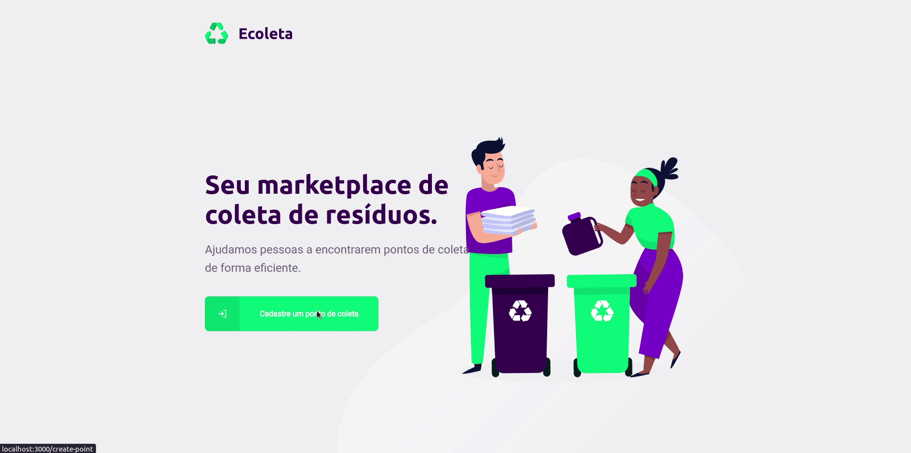

<h1 align="center">
  
</h1>

<!-- Desktop -->

<!-- Mobile -->

# Indice
- [Sobre](#-sobre)
- [Tecnologias utilizadas](#-tecnologias-utilizadas)
- [Como baixar](#-como-baixar)
- [Como rodar](#-como-rodar)

## 📄 Sobre
O **Ecoleta** é um projeto marketplace desenvolvido durante a primeira **Next Level Week**, com intuito de mostrar na prática a stack.

---

## 📌 Tecnologias utilizadas
### Server
- [Node](https://nodejs.org/en/)
- [Express](https://expressjs.com/pt-br/)
- [Knex](http://knexjs.org/)
- [Celebrate](https://github.com/arb/celebrate)

### Web
- [ReactJS](https://pt-br.reactjs.org/)
- [Axios](https://github.com/axios/axios)
- [Dropzone](https://github.com/react-dropzone/react-dropzone)
- [Leaflet](https://leafletjs.com/)

### Mobile
- [React Native](https://reactnative.dev/)
- [Expo](https://expo.io/)
- [Mail Composer](https://www.npmjs.com/package/react-native-mail-compose)
- [React Navigation](https://reactnavigation.org/)

---

## 📦 Como baixar

```bash
  # Clone do repositório
  $ git clone https://github.com/shindhi/NLW-01.git

  # Acessar a pasta do projeto
  $ cd NLW-01
```

## 🔧 Como rodar
###  Server
```bash
  # Acessar a pasta
  $ cd server

  # Instalar as dependências
  $ yarn

  # Inciar o server
  $ yarn dev:server
```
---

- Para que o front e o mobile funcione, é preciso deixar o servidor rodando
### 💻 Web
```bash
  # Acessar a pasta
  $ cd web

  # Instalar as dependências
  $ yarn

  # Inicia a aplicação
  $ yarn start
```
### 📱 Mobile
```bash
  # Acessar a pasta
  $ cd mobile

  # Instalar as dependências
  $ yarn

  # Inicia a aplicação
  $ yarn start

  # Depois de iniciado, scanear o QR Code utilizando o Expo no celular 
```

O projeto ainda não está terminado.😅 
